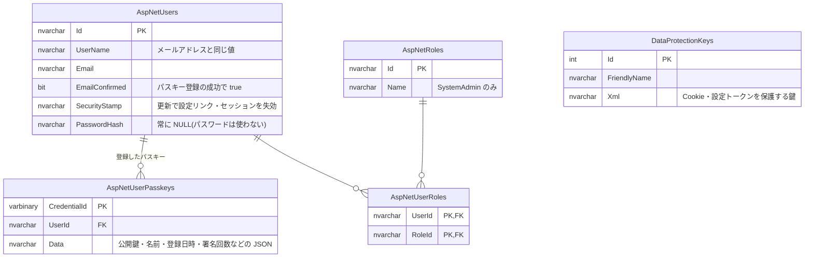

# 認証(パスキー)

パスキーのみによる認証と、システム管理者によるパスキーの再設定。方針の経緯は [decisions/0002](../../decisions/0002-passkey-only-authentication.md)、[decisions/0003](../../decisions/0003-authorization-model.md) を参照。

## ER 図

ASP.NET Core Identity(スキーマ Version3)のテーブルのうち、この機能で使うもの。`AspNetUserClaims`・`AspNetUserLogins`・`AspNetUserTokens`・`AspNetRoleClaims` は作られるが、現時点では使っていない。

## 画面操作と CRUD の対応

対象コントローラー: `AuthController`(`/api/auth`)、`AdminUsersController`(`/api/admin/users`)

| 画面 | 操作 | API | AspNetUsers | AspNetUserPasskeys | AspNetUserRoles |
| --- | --- | --- | --- | --- | --- |
| `/register` | 確認メールを送信 | POST `register` | C(未登録時) / R | | |
| `/auth/setup-passkey` | 画面表示後にパスキーを作成 | POST `passkey-setup/options`、POST `passkey-setup` | R / U(EmailConfirmed・SecurityStamp) | C | |
| `/login` | パスキーでサインイン | POST `login/options`、POST `login` | R | R / U(署名回数) | R |
| `/account` | 表示 | GET `me`、GET `passkeys` | R | R | R |
| `/account` | パスキーを追加 | POST `passkeys/options`、POST `passkeys` | R | C | |
| `/account` | パスキーを削除(最後の 1 つは不可) | DELETE `passkeys/{id}` | R | R / D | |
| `/account` | サインアウト | POST `logout` | | | |
| `/admin/users` | パスキーの再設定 | POST `passkey-reset`(SystemAdmin のみ) | R / U(SecurityStamp) | D(全件) | R |
| (コマンド) | 管理者の付与 | `dotnet run --project backend -- grant-system-admin <email>` | R | | C |
